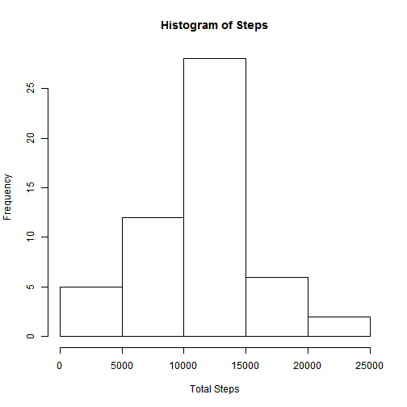
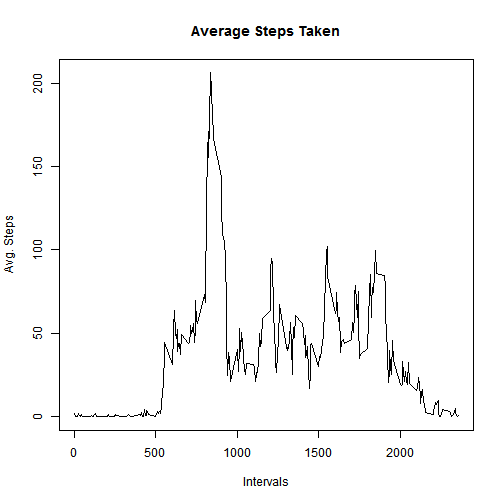
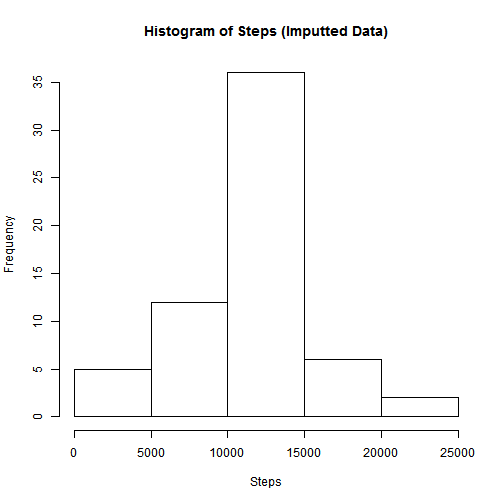
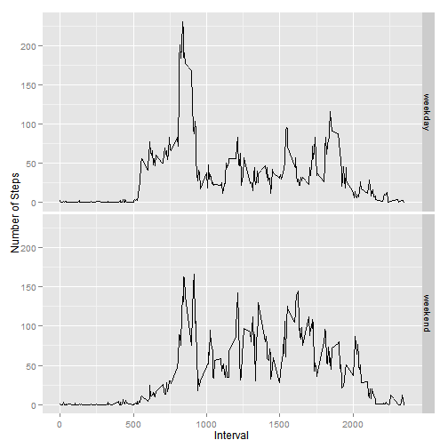

```r
library(knitr)
library(ggplot2)
```

## Loading and preprocessing the data


```r
actRawData <- read.csv("./activity/activity.csv", header= TRUE, 
                 colClasses=c("integer", "Date", "integer"), na.strings=("NA") )
```
## What is mean total number of steps taken per day?

###  total number of steps taken each day

```r
totalNumStepsByDat <- aggregate(steps ~ date, actRawData, sum)

hist(totalNumStepsByDat$steps, xlab="Total Steps", main="Histogram of Steps")
```

 

```r
mean(totalNumStepsByDat$steps)
```

```
## [1] 10766.19
```

```r
median(totalNumStepsByDat$steps)
```

```
## [1] 10765
```
## What is the average daily activity pattern?

### Make a time series plot (i.e. type = "l") of the 5-minute interval (x-axis) and the average number of steps taken, averaged across all days (y-axis)

```r
fiveMinAvgSteps <- aggregate(steps ~ interval, actRawData, mean)

plot(fiveMinAvgSteps$interval, fiveMinAvgSteps$steps, type = "l", xlab="Intervals", ylab="Avg. Steps", main="Average Steps Taken") 
```

 

### Which 5-minute interval, on average across all the days in the dataset, contains the maximum number of steps?

```r
fiveMinAvgSteps[which.max(fiveMinAvgSteps$steps ), "interval"]
```

```
## [1] 835
```

## Imputing missing values

### Calculate and report the total number of missing values in the dataset (i.e. the total number of rows with NAs)

```r
sum(is.na(actRawData$steps))
```

```
## [1] 2304
```

```r
actUpdData <- actRawData
```
### Replace missing data with the mean for that 5-minute interval 

```r
actUpdData[is.na(actUpdData$steps),1] <- subset(fiveMinAvgSteps, interval == interval, select=steps)

totalNumStepsByDatImputted <- aggregate(steps ~ date, actUpdData, sum)

hist(totalNumStepsByDatImputted$steps, xlab="Steps", main="Histogram of Steps (Imputted Data)")
```

 

```r
mean(totalNumStepsByDatImputted$steps)
```

```
## [1] 10766.19
```

```r
median(totalNumStepsByDatImputted$steps)
```

```
## [1] 10766.19
```

## Are there differences in activity patterns between weekdays and weekends?


```r
actUpdData$dayType <- ifelse(weekdays(actUpdData$date) == "Saturday" | weekdays(actUpdData$date) == "Sunday", "weekend", "weekday")

actUpdData$dayType <- as.factor(actUpdData$dayType)

fiveMinAvgStepsImputted <- aggregate(steps ~ interval + dayType, actUpdData, mean)

qplot(x=interval, y=steps, data = fiveMinAvgStepsImputted, facets = dayType ~ ., geom="line", xlab="Interval", ylab="Number of Steps")
```

 
